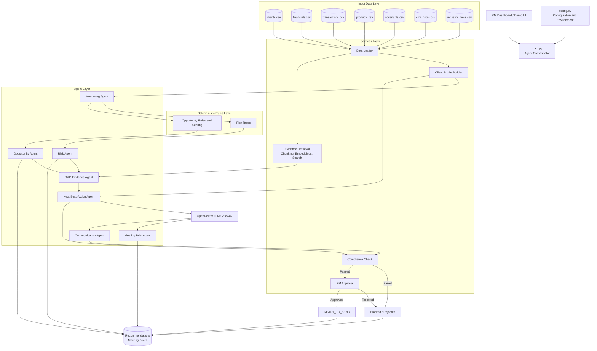

# Commercial Banking Relationship Manager Copilot

## 1. Project Objective

Build an agentic assistant for commercial banking Relationship Managers (RMs) that brings together fragmented client information and proactively identifies risks, opportunities, and next-best-actions.

The Copilot will analyze fictional:

- Client financials
- Account behavior
- Product usage
- Covenant status
- CRM notes
- Market and industry news

It will use this information to:

- Identify early warning signals
- Identify cross-sell and retention opportunities
- Retrieve supporting evidence from client documents
- Recommend next-best-actions
- Prepare client meeting briefs
- Draft client outreach emails
- Apply basic compliance checks
- Require RM approval before a client communication can be sent

### Core workflow

```text
Client Data
    ↓
Monitor
    ↓
Detect Risks & Opportunities
    ↓
Retrieve Evidence
    ↓
Reason / Score
    ↓
Next-Best-Action
    ↓
Meeting Brief / Communication Draft
    ↓
Compliance Check
    ↓
RM Approval
```

The project will use **fictional commercial-banking data only**.

---

## 2. Business Objective

The goal is to improve Relationship Manager productivity by turning fragmented client information into **proactive, explainable relationship actions**.

The Copilot should help an RM answer:

- What is happening with this client?
- What risks should I know about?
- What opportunities should I discuss?
- Why is the system recommending this action?
- What evidence supports the recommendation?
- What should I discuss in my next meeting?
- What outreach could I send?

---

## 3. MVP Scope

The MVP will implement exactly these capabilities:

1. Fictional CRM and banking data
2. Client information consolidation
3. Client financial monitoring
4. Account behavior monitoring
5. Product usage analysis
6. Covenant monitoring
7. Industry/market news monitoring
8. Early warning risk detection
9. Cross-sell opportunity detection
10. Retention opportunity detection
11. RAG-based evidence retrieval
12. Opportunity scoring
13. Next-best-action generation
14. Meeting brief generation
15. Outreach email drafting
16. Basic compliance checking
17. Human approval before communication

---

## 4. Project Structure

```text
capstone_project/
├── README.md
├── requirements.txt
├── .env.example
├── main.py
├── config.py
├── high_level_description.txt
├── CAPSTONE_PLAN.md
├── data/
│   ├── clients.csv
│   ├── financials.csv
│   ├── transactions.csv
│   ├── products.csv
│   ├── covenants.csv
│   ├── crm_notes.csv
│   └── industry_news.csv
├── agents/
│   ├── monitoring_agent.py
│   ├── risk_agent.py
│   ├── opportunity_agent.py
│   ├── rag_agent.py
│   ├── next_best_action_agent.py
│   ├── meeting_brief_agent.py
│   └── communication_agent.py
├── services/
│   ├── data_loader.py
│   ├── client_profile.py
│   ├── retrieval.py
│   ├── llm_client.py
│   ├── compliance.py
│   └── approval.py
├── rules/
│   ├── risk_rules.py
│   └── opportunity_rules.py
├── prompts/
│   ├── risk_prompt.txt
│   ├── opportunity_prompt.txt
│   ├── nba_prompt.txt
│   ├── meeting_prompt.txt
│   └── communication_prompt.txt
├── outputs/
│   ├── meeting_briefs/
│   └── recommendations/
└── tests/
    ├── test_risk_rules.py
    ├── test_opportunities.py
    ├── test_retrieval.py
    ├── test_compliance.py
    └── test_approval.py
```

---

## 5. Fictional Data

Create fictional commercial-banking clients.

Each client should have information such as:

```text
Client
├── Company information
├── Financial information
├── Account activity
├── Banking products
├── Loan/covenant information
├── CRM/RM notes
└── Industry information
```

### `clients.csv`

```text
client_id
company_name
industry
annual_revenue
relationship_manager
region
```

### `financials.csv`

```text
financial_id
client_id
reporting_period
revenue
ebitda
net_income
cash_balance
debt
source
```

### `transactions.csv`

```text
transaction_id
client_id
date
account_type
transaction_type
amount
balance
source
```

### `products.csv`

```text
product_id
client_id
product_name
status
usage_level
last_used
```

Examples:

```text
Operating Account
Term Loan
Working Capital Facility
Trade Finance
Cash Management
Payroll
Merchant Services
```

### `covenants.csv`

```text
covenant_id
client_id
covenant_type
threshold
current_value
status
date
source
```

### `crm_notes.csv`

```text
note_id
client_id
date
relationship_manager
note
source
```

### `industry_news.csv`

```text
news_id
industry
date
headline
summary
risk_indicator
source
```

All data should be **fictional**.

---

## 6. Client Profile

Create a simple consolidated client profile.

```text
CLIENT PROFILE

Company
Industry
Revenue
Financial Performance
Account Behavior
Banking Products
Credit/Covenants
CRM History
Industry Risk
```

The profile gives the agents the context needed to make recommendations.

---

## 7. Monitoring

The Monitoring Agent examines the available client information and identifies meaningful changes.

It should monitor:

### Financials

- Revenue changes
- EBITDA changes
- Profitability
- Cash position
- Debt levels

### Account behavior

- Balance changes
- Transaction activity
- Payment behavior
- Deposit trends

### Product usage

- Products currently used
- Products with low usage
- Products the client does not currently use

### Covenants

- Current covenant value
- Covenant threshold
- Covenant status

### Industry

- Positive industry movement
- Negative industry movement
- Relevant market risks

---

## 8. Risk Detection

The Risk Agent identifies early warning signals.

Initial examples:

### Declining balance

```text
If account balance falls significantly:
    create liquidity risk signal
```

### Covenant stress

```text
If covenant value approaches threshold:
    create covenant risk signal
```

### Delayed payments

```text
If delayed payment is detected:
    create payment risk signal
```

### Industry risk

```text
If relevant industry news indicates deterioration:
    create industry risk signal
```

Each risk should contain:

```text
Risk
Priority
What happened
Why it matters
Evidence
Recommended RM action
```

The thresholds should be implemented as simple deterministic rules rather than asking the LLM to calculate them.

---

## 9. Opportunity Detection

The Opportunity Agent identifies **cross-sell and retention opportunities**.

Examples:

### Working capital

Evidence:

```text
High transaction activity
+
Declining cash balance
+
Growing receivables
```

Potential opportunity:

```text
Working Capital Facility
```

### Cash management

Evidence:

```text
Large transaction volume
+
Limited cash-management product usage
```

Potential opportunity:

```text
Cash Management
```

### Trade finance

Evidence:

```text
International transactions
+
No trade-finance product
```

Potential opportunity:

```text
Trade Finance
```

### Payroll

Evidence:

```text
Regular employee-related payments
+
No payroll product
```

Potential opportunity:

```text
Payroll Services
```

### Retention

Evidence:

```text
Declining balances
+
Lower product usage
+
Negative CRM interaction
```

Potential action:

```text
Schedule relationship review
```

**Important:** The system must not recommend a product simply because it exists. There must be observable client evidence supporting the opportunity.

---

## 10. Opportunity Scoring

Each opportunity receives a simple score based on:

```text
Evidence Strength
+
Client Need
+
Relationship Relevance
+
Timing
```

Example:

```text
Opportunity:
Working Capital Facility

Score:
87/100

Evidence:
- Cash balance declined
- Transaction volume increased
- CRM note mentions working-capital pressure
```

The score should help the RM prioritize opportunities.

---

## 11. RAG / Evidence Retrieval

Implement a simple RAG system.

The system should:

```text
Load client documents/notes
        ↓
Split into chunks
        ↓
Create embeddings
        ↓
Store in local vector index
        ↓
Search relevant evidence
        ↓
Return supporting evidence
```

Possible evidence:

- Financial information
- CRM notes
- Loan information
- Covenant information
- Transaction history
- Industry news

Every retrieved result should contain:

```text
Source ID
Client ID
Document type
Date
Text/excerpt
Relevance score
```

If the system cannot find supporting evidence:

```text
No supporting evidence found.
RM review required.
```

---

## 12. Next-Best-Action Agent

The Next-Best-Action Agent combines:

```text
Client Profile
+
Risk Signals
+
Opportunity Signals
+
Retrieved Evidence
+
CRM Context
```

and produces a recommendation.

Example:

```text
NEXT BEST ACTION

Action:
Schedule a working-capital discussion.

Reason:
The client's operating-account balance has declined while
transaction activity has increased.

Evidence:
TXN-104
FIN-022
CRM-031

Priority:
High

Confidence:
0.87
```

The recommendation must be explainable.

---

## 13. Meeting Brief Agent

The Meeting Brief Agent prepares a concise RM briefing.

Example structure:

```text
CLIENT MEETING BRIEF

Client:
ABC Manufacturing

Overview:
...

Financial Performance:
...

Account Behavior:
...

Product Usage:
...

Risks:
...

Opportunities:
...

Recent CRM Activity:
...

Industry Context:
...

Key Talking Points:
1.
2.
3.

Recommended Next Steps:
1.
2.
```

The brief should help the RM prepare for a client meeting quickly.

---

## 14. Communication Agent

The Communication Agent drafts client outreach based on an approved recommendation.

Example:

```text
Subject:
Working Capital Discussion

Body:
Dear ...

Based on our recent discussions and your company's recent
activity, I would like to schedule a conversation about your
working-capital requirements...

Regards,
Relationship Manager
```

The system **only drafts** the communication.

It must not independently send anything to the client.

---

## 15. Compliance Check

Before an email can be presented for approval, run a basic compliance check.

Check for:

- Unsupported financial claims
- Invented client information
- Unsupported numbers
- Guaranteed outcomes
- Unapproved promises
- Inappropriate product claims
- Unsupported recommendations

Example:

```text
Compliance Status:
PASS

Unsupported Claims:
None

Evidence:
All client-specific claims supported.
```

If the check fails:

```text
Compliance Status:
BLOCKED

Reason:
Communication contains an unsupported financial claim.
```

The draft cannot proceed until corrected.

---

## 16. Human Approval

Implement the assignment's bonus feature:

```text
Recommendation
      ↓
Communication Draft
      ↓
Compliance Check
      ↓
RM Review
      ↓
Approve / Reject
      ↓
If Approved → Ready to Send
If Rejected → Stop
```

There must be an explicit approval action.

For example:

```text
Recommendation approved by RM-001

Approval:
APPROVED

Communication:
READY FOR SEND
```

The system should **never automatically send the client communication**.

For the MVP, "send" can simply mean:

```text
Communication approved and marked READY_TO_SEND
```

No real external email integration is required.

---

## 17. OpenRouter

Use OpenRouter as the LLM gateway.

Environment variables:

```text
OPENROUTER_API_KEY=your_key_here
OPENROUTER_MODEL=your_model_here
```

Use the LLM for:

- Explaining detected signals
- Summarizing client information
- Opportunity reasoning
- Next-best-action reasoning
- Meeting briefs
- Communication drafts

Keep calculations and basic risk/opportunity detection in Python rules.

---

## 18. Main Agentic Flow

The final application should demonstrate:

### Implementation Architecture Diagram



The implementation flow is:

```text
RM Dashboard
    ↓
main.py Agent Orchestrator
    ↓
Data Loader → Client Profile
    ↓
Monitoring Agent
    ├── Risk Rules → Risk Agent
    └── Opportunity Rules → Opportunity Agent
                ↓
        Retrieval Service → RAG Agent
                ↓
        Next-Best-Action Agent
                ↓
        OpenRouter LLM Gateway
                ├── Meeting Brief Agent
                └── Communication Agent
                            ↓
                    Compliance Service
                            ↓
                    RM Approval Service
                    ├── Approved output
                    └── Rejected or blocked output
```

The final application should demonstrate:

```text
                CLIENT DATA
                    ↓
              CLIENT PROFILE
                    ↓
               MONITORING
                    ↓
          ┌─────────┴─────────┐
          ↓                   ↓
       RISKS             OPPORTUNITIES
          ↓                   ↓
          └─────────┬─────────┘
                    ↓
              RAG EVIDENCE
                    ↓
             NEXT BEST ACTION
                    ↓
              MEETING BRIEF
                    ↓
           COMMUNICATION DRAFT
                    ↓
            COMPLIANCE CHECK
                    ↓
              RM APPROVAL
                    ↓
          READY TO SEND / STOP
```

---

## 19. Dashboard / Demo Output

The application should show:

```text
========================================
COMMERCIAL BANKING RM COPILOT
========================================

CLIENT
ABC Manufacturing

INDUSTRY
Manufacturing

----------------------------------------
RISKS
----------------------------------------

1. Declining Account Balance
Priority: HIGH

What happened:
Operating balance declined significantly.

Why it matters:
May indicate increasing liquidity requirements.

Evidence:
TXN-104
FIN-022

----------------------------------------
OPPORTUNITIES
----------------------------------------

1. Working Capital Facility
Score: 87/100

Evidence:
- Declining cash balance
- Increased transaction activity
- CRM note indicating working-capital pressure

----------------------------------------
NEXT BEST ACTION
----------------------------------------

Schedule a working-capital discussion.

Confidence: 0.87

----------------------------------------
MEETING BRIEF
----------------------------------------

...

----------------------------------------
COMMUNICATION
----------------------------------------

Subject:
...

Body:
...

Compliance:
PASS

Approval:
PENDING
```

---

## 20. Testing

Keep testing focused on the actual assignment.

Test:

### Risk detection

```text
Declining balance → risk detected
Delayed payment → risk detected
Covenant stress → risk detected
Industry deterioration → risk detected
```

### Opportunity detection

```text
Evidence of working-capital need → opportunity detected
Trade activity + no trade product → opportunity detected
High transaction activity + no cash management → opportunity detected
```

### RAG

```text
Relevant evidence → retrieved
No evidence → recommendation flagged
```

### Compliance

```text
Supported communication → PASS
Unsupported claim → BLOCK
```

### Approval

```text
Approved → READY_TO_SEND
Rejected → STOP
No approval → cannot send
```

---

## 21. Evaluation

Evaluate the Copilot using metrics directly relevant to the assignment:

- **Risk detection accuracy**
- **Opportunity relevance**
- **Evidence validity**
- **Next-best-action usefulness**
- **Meeting brief quality**
- **Communication quality**
- **Compliance accuracy**
- **RM acceptance rate**
- **Meeting-preparation time reduction**

The primary success criterion is:

> **Reduce Relationship Manager effort by turning fragmented client information into proactive, evidence-based and explainable relationship actions.**

---

## 22. Learning Takeaways Demonstrated

| Assignment learning takeaway | Project implementation |
|---|---|
| CRM integration | `crm_notes.csv` + client profile |
| Core-banking integration | Transactions, balances, financials |
| Next-best-action reasoning | NBA Agent |
| RAG over client documents | Local vector retrieval |
| Opportunity scoring | Opportunity Agent |
| Compliance-aware communication | Compliance Check |
| Human-in-the-loop controls | RM approval |

### Final Scope

**Do not turn this into a full banking platform.**

The project is simply:

> **A Commercial Banking Relationship Manager Copilot that analyzes fictional client data, detects risks and opportunities, retrieves supporting evidence, recommends next-best-actions, prepares meeting briefs, drafts outreach, and requires RM approval before communication.**
