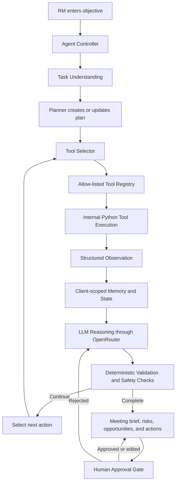
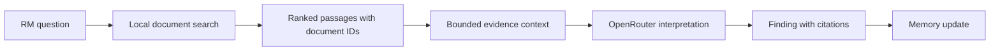
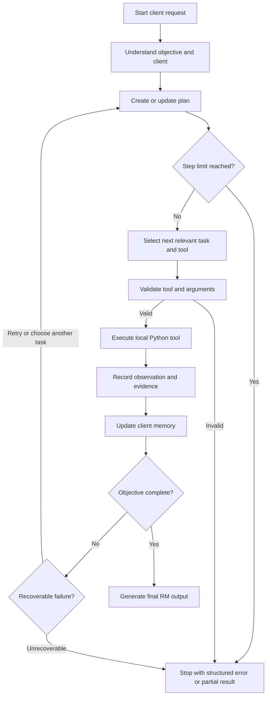
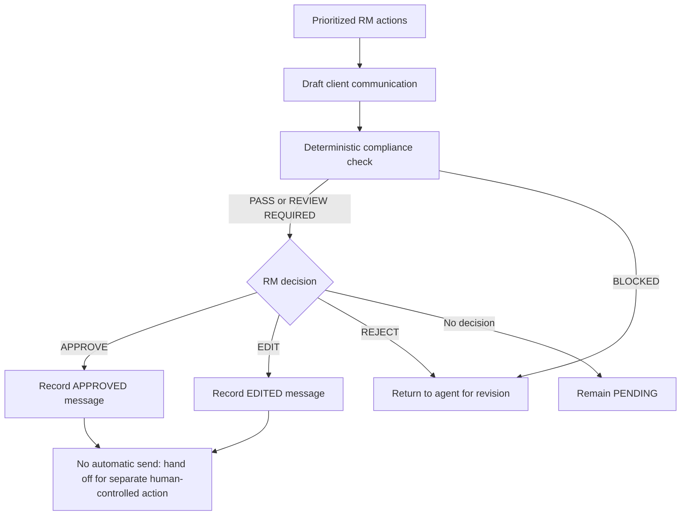

# Commercial Banking Relationship Manager Copilot — Planning Document

## 1. Project Objective

Build a new agentic AI assistant for Commercial Banking Relationship Managers (RMs). The assistant will analyze fictional, local client information and convert fragmented evidence into proactive, explainable relationship actions.

The assistant will support:

- Financial health analysis.
- Account behavior and payment analysis.
- Covenant and early-warning monitoring.
- Industry and market risk analysis.
- Cross-sell and retention opportunity discovery.
- CRM and client-document research.
- Local retrieval-augmented generation (RAG).
- Next-best-action recommendations.
- Meeting brief generation.
- Client communication drafting.
- Compliance checking.
- Human approval before any client communication is sent.

The system is a planning and decision-support assistant only. It must never automatically send communication, change banking records, approve credit, modify limits, or connect to real banking systems.

## 2. Development Constraints

1. Use Python.
2. Develop and demonstrate the project in Visual Studio Code.
3. Use the OpenRouter API as the LLM access layer.
4. Do not use LangChain, LangGraph, CrewAI, AutoGen, Semantic Kernel, or any other third-party agent orchestration framework.
5. Implement the agent controller, planning loop, tool selection, memory updates, and safety gates manually in Python.
6. Implement internal tools as new Python functions and modules.
7. Use only synthetic/local CSV, JSON, and text-document data.
8. Do not connect to production or real banking systems.
9. Do not use real customer or client information.
10. Keep the design modular and understandable for a capstone presentation.
11. Implement explicit client-scoped memory/state management.
12. Demonstrate allow-listed tool calling.
13. Demonstrate multi-step agentic reasoning based on observations and previous state.
14. Include a human-in-the-loop approval gate before client communication.
15. Support explainable recommendations backed by retrieved evidence.
16. Write all implementation code from scratch. Do not import, call, copy, or depend on existing workspace code, prompts, clients, data, or tests.

## 3. Fresh-Implementation Boundary

This project must be implemented independently. Existing files in the workspace are reference context only and must not be reused, including:

- The universal workflow generator.
- Existing OpenRouter clients or prompts.
- Existing commercial-banking scripts.
- Existing preprocessing, NLP, scoring, RAG, or approval modules.
- Existing banking CSV, JSON, text, or corpus data.

The new project must define its own modules, schemas, synthetic data, documents, prompts, tests, and configuration. The implementation must not import from sibling `problem_*` directories or `universal_project`.

## 4. Scope

### In scope

- Natural-language RM request intake.
- Client identification and validation.
- Task understanding and dynamic planning.
- Manual agent orchestration.
- Allow-listed internal tool selection and execution.
- Structured tool results containing findings and evidence.
- Explicit state updates after every observation.
- Financial, account, payment, covenant, market, product, CRM, and document analysis.
- Local document search and lightweight RAG.
- Explainable risk and opportunity scoring.
- Meeting briefs and next-best-actions.
- Communication drafting and deterministic compliance checks.
- Human approve, edit, reject, and revision paths.
- Error handling, logging, bounded execution, and tests.

### Out of scope

- Real banking integrations.
- Real customer data.
- Automatic communication sending.
- Autonomous lending, credit, legal, regulatory, hiring, or other consequential decisions.
- Modification of bank records.
- Purchases, approvals, commitments, or irreversible actions.
- Production-grade vector databases or workflow-execution infrastructure.
- Execution of arbitrary code returned by an LLM.

## 5. Core Agent Architecture

The agent must not be a fixed checklist. It must interpret the RM objective, create or update a plan, select relevant tools, inspect observations, update memory, reason about the next action, and stop when the objective is complete or a safety/error condition requires stopping.



### Component responsibilities

- **Agent Controller:** Owns the bounded loop, state transitions, tool execution, error handling, and stopping conditions.
- **Task Understanding:** Extracts the client, objective, requested outputs, constraints, and missing information.
- **Planner:** Creates a plan of relevant tasks and dependencies without assuming every tool is needed.
- **Tool Selector:** Produces a structured tool-call decision; it cannot execute code.
- **Tool Registry:** Maps approved tool names to Python callables and rejects unknown tools.
- **Internal Tools:** Read local synthetic data, calculate deterministic metrics, search documents, or format structured outputs.
- **Observation Layer:** Normalizes successes and failures into a common result contract.
- **Memory:** Stores client context, completed tasks, tool calls, findings, evidence, recommendations, and approval status.
- **OpenRouter Adapter:** Sends bounded context to the configured model and parses structured decisions.
- **Deterministic Controls:** Validate tool names and arguments, calculate scores, check compliance, enforce approval, and prevent unsafe publication.
- **Human Approval Gate:** Controls external communication and supports approve, edit, reject, and revision.

## 6. Exact Five Agent Goals and 25 Tasks

The implementation must support exactly these five goals and exactly five tasks under each goal. The tasks are the planning contract; the agent may skip tasks that are irrelevant or lack required evidence while retaining them in the plan.

### Goal 1 — Understand Client Financial Health

**Outcome:** Produce a current and historical financial health assessment for the client.

1. **Retrieve financial profile**
   - Tool: `financial_profile_tool`
   - Purpose: Retrieve revenue, profit, debt, liquidity, cash flow, and other synthetic financial metrics.
   - Inputs: `client_id`, `financial_period`.
   - Outputs: `financial_profile`, `financial_metric_sources`.
   - Depends on: Client identification.
   - Condition: Continue only when the client exists and financial data is available.

2. **Analyze balance trends**
   - Tool: `account_analysis_tool`
   - Purpose: Compare current and historical account balances and calculate percentage changes.
   - Inputs: `client_id`, `balance_history`.
   - Outputs: `balance_change_percent`, `balance_trend`, `balance_evidence`.
   - Depends on: `G001-T001`.
   - Condition: Skip when account history is missing.

3. **Analyze payment behavior**
   - Tool: `transaction_tool`
   - Purpose: Identify delayed, missed, returned, or irregular payments from local transactions.
   - Inputs: `client_id`, `transaction_window`.
   - Outputs: `late_payment_count`, `payment_behavior_summary`, `payment_evidence`.
   - Depends on: Client identification.
   - Condition: Continue when transaction records exist; otherwise mark data unavailable.

4. **Identify financial deterioration**
   - Tool: `financial_analysis_tool`
   - Purpose: Detect declining revenue, profitability, liquidity, cash flow, or balances using deterministic comparisons.
   - Inputs: `financial_profile`, `balance_trend`, `payment_behavior_summary`.
   - Outputs: `deterioration_indicators`, `deterioration_severity`, `deterioration_evidence`.
   - Depends on: `G001-T001`, `G001-T002`, `G001-T003`.
   - Condition: Pause if required observations are unavailable; do not infer unsupported deterioration.

5. **Generate financial health assessment**
   - Tool: `financial_scoring_tool`
   - Purpose: Combine financial findings into an explainable health score and assessment.
   - Inputs: `financial_profile`, `deterioration_indicators`, `payment_behavior_summary`.
   - Outputs: `financial_health_score`, `financial_health_rating`, `financial_health_reasons`.
   - Depends on: `G001-T004`.
   - Condition: Generate a score only when evidence meets the configured minimum.

### Goal 2 — Detect Risk and Early Warning Signals

**Outcome:** Detect and prioritize supported credit, covenant, payment, account, and industry risks.

1. **Check covenant status**
   - Tool: `covenant_tool`
   - Purpose: Compare synthetic covenant metrics with configured limits.
   - Inputs: `client_id`, `covenant_metrics`, `covenant_limits`.
   - Outputs: `covenant_status`, `covenant_breaches`, `covenant_evidence`.
   - Depends on: Client identification.
   - Condition: Skip when no covenant information is available.

2. **Detect covenant stress**
   - Tool: `risk_analysis_tool`
   - Purpose: Identify metrics approaching covenant thresholds before a breach occurs.
   - Inputs: `covenant_metrics`, `covenant_limits`.
   - Outputs: `covenant_stress_level`, `threshold_proximity`, `stress_evidence`.
   - Depends on: `G002-T001`.
   - Condition: Continue only when covenant thresholds are explicit.

3. **Detect delayed payments**
   - Tool: `payment_monitoring_tool`
   - Purpose: Detect payment irregularities and deterioration over the configured monitoring window.
   - Inputs: `payment_behavior_summary`, `transaction_window`.
   - Outputs: `payment_risk_level`, `payment_risk_drivers`, `payment_risk_evidence`.
   - Depends on: `G001-T003`.
   - Condition: Mark unresolved when transaction evidence is incomplete.

4. **Analyze industry and market risk**
   - Tool: `market_news_tool`
   - Purpose: Retrieve relevant synthetic industry and market signals for the client sector.
   - Inputs: `client_industry`, `market_time_window`.
   - Outputs: `market_risk_signals`, `market_risk_level`, `market_sources`.
   - Depends on: Client profile.
   - Condition: Skip when the industry is unknown or no local news matches.

5. **Generate risk alerts**
   - Tool: `risk_scoring_tool`
   - Purpose: Combine supported risk signals and assign `LOW`, `MEDIUM`, `HIGH`, or `CRITICAL` severity with evidence.
   - Inputs: `covenant_status`, `covenant_stress_level`, `payment_risk_level`, `market_risk_signals`, `deterioration_indicators`.
   - Outputs: `risk_alerts`, `highest_risk_severity`, `risk_alert_evidence`.
   - Depends on: `G002-T001`, `G002-T002`, `G002-T003`, `G002-T004`, and `G001-T004`.
   - Condition: Do not generate a confident alert without a traceable supporting signal.

### Goal 3 — Discover Growth and Relationship Opportunities

**Outcome:** Identify explainable cross-sell, retention, and relationship-growth opportunities.

1. **Analyze current products**
   - Tool: `product_usage_tool`
   - Purpose: Identify products currently used by the client and recent usage patterns.
   - Inputs: `client_id`, `product_usage_records`.
   - Outputs: `active_products`, `product_usage_trends`, `product_usage_evidence`.
   - Depends on: Client identification.
   - Condition: Continue when product records are present.

2. **Identify product gaps**
   - Tool: `product_gap_tool`
   - Purpose: Compare supported client needs with active products to identify evidence-based gaps.
   - Inputs: `active_products`, `client_needs`, `product_catalog`.
   - Outputs: `product_gaps`, `gap_reasons`, `gap_evidence`.
   - Depends on: `G003-T001`.
   - Condition: Skip when needs or product catalog data is unavailable.

3. **Detect cross-sell opportunities**
   - Tool: `cross_sell_tool`
   - Purpose: Match client needs, product gaps, and relationship context to potential offerings without making an automatic offer.
   - Inputs: `product_gaps`, `financial_profile`, `crm_findings`.
   - Outputs: `cross_sell_candidates`, `opportunity_reasons`, `opportunity_evidence`.
   - Depends on: `G003-T002`, `G001-T001`, and CRM findings when available.
   - Condition: Produce candidates only when fit and evidence are present.

4. **Identify retention opportunities**
   - Tool: `relationship_health_tool`
   - Purpose: Detect declining activity, product disengagement, unresolved concerns, or potential attrition.
   - Inputs: `product_usage_trends`, `account_trend`, `crm_findings`.
   - Outputs: `retention_signal`, `relationship_health_rating`, `retention_evidence`.
   - Depends on: `G003-T001`, `G001-T002`, and CRM findings when available.
   - Condition: Mark as limited when relationship history is incomplete.

5. **Rank opportunities**
   - Tool: `opportunity_scoring_tool`
   - Purpose: Score opportunities using deterministic value, fit, urgency, and evidence factors.
   - Inputs: `cross_sell_candidates`, `retention_signal`, `risk_alerts`.
   - Outputs: `ranked_opportunities`, `opportunity_scores`, `opportunity_score_reasons`.
   - Depends on: `G003-T003`, `G003-T004`, and `G002-T005`.
   - Condition: Rank only supported opportunities; never invent a product need.

### Goal 4 — Research Client and Prepare Meeting

**Outcome:** Provide a source-linked meeting brief with context, risks, opportunities, and discussion points.

1. **Retrieve CRM history**
   - Tool: `crm_search_tool`
   - Purpose: Search synthetic relationship notes and prior RM interactions.
   - Inputs: `client_id`, `crm_query`, `crm_time_window`.
   - Outputs: `crm_findings`, `crm_sources`, `open_follow_ups`.
   - Depends on: Client identification.
   - Condition: Continue when CRM notes exist; otherwise report no matching history.

2. **Retrieve client documents**
   - Tool: `document_search_tool`
   - Purpose: Search local client documents and return matching passages with document identifiers.
   - Inputs: `client_id`, `document_query`.
   - Outputs: `document_matches`, `document_ids`, `document_sources`.
   - Depends on: Client identification.
   - Condition: Skip when the document directory is unavailable.

3. **Perform RAG analysis**
   - Tool: `rag_tool`
   - Purpose: Build a bounded context from retrieved document passages and interpret it through OpenRouter when configured.
   - Inputs: `document_matches`, `rm_question`.
   - Outputs: `rag_findings`, `rag_answer`, `rag_citations`.
   - Depends on: `G004-T002`.
   - Condition: Pause or return no-evidence when no document matches are found.

4. **Identify discussion points**
   - Tool: `meeting_analysis_tool`
   - Purpose: Convert financial, risk, opportunity, CRM, and document findings into prioritized RM discussion topics.
   - Inputs: `financial_health_assessment`, `risk_alerts`, `ranked_opportunities`, `crm_findings`, `rag_findings`.
   - Outputs: `discussion_points`, `discussion_priorities`, `discussion_evidence`.
   - Depends on: `G001-T005`, `G002-T005`, `G003-T005`, `G004-T001`, and `G004-T003`.
   - Condition: Include only topics supported by available evidence.

5. **Generate meeting brief**
   - Tool: `meeting_brief_tool`
   - Purpose: Create a structured meeting brief containing the client overview, relationship summary, financial snapshot, account behavior, products, CRM history, document findings, risks, opportunities, discussion points, and next-best-actions.
   - Inputs: `client_profile`, `financial_health_assessment`, `risk_alerts`, `ranked_opportunities`, `discussion_points`, `crm_findings`, `rag_findings`.
   - Outputs: `meeting_brief`, `meeting_brief_sources`, `brief_completeness_status`.
   - Depends on: `G004-T004`.
   - Condition: Generate a partial brief with explicit missing-data markers when some sections are unavailable.

### Goal 5 — Recommend and Execute Next-Best-Actions

**Outcome:** Produce prioritized relationship actions and control any client communication through compliance and human approval.

1. **Generate next-best-actions**
   - Tool: `nba_reasoning_tool`
   - Purpose: Propose explainable actions for the RM based on findings and the meeting objective.
   - Inputs: `risk_alerts`, `ranked_opportunities`, `discussion_points`, `meeting_objective`.
   - Outputs: `recommended_actions`, `action_reasons`, `action_evidence`.
   - Depends on: `G002-T005`, `G003-T005`, and `G004-T004`.
   - Condition: Recommendations must be framed as RM actions, not autonomous decisions.

2. **Prioritize actions**
   - Tool: `action_priority_tool`
   - Purpose: Rank actions by urgency, risk, relationship value, opportunity, and evidence quality.
   - Inputs: `recommended_actions`, `risk_alerts`, `ranked_opportunities`.
   - Outputs: `prioritized_actions`, `priority_levels`, `priority_reasons`.
   - Depends on: `G005-T001`.
   - Condition: Do not prioritize actions lacking evidence or a clear owner.

3. **Draft client communication**
   - Tool: `communication_draft_tool`
   - Purpose: Draft a reviewable client message based on the approved objective and retrieved evidence.
   - Inputs: `client_name`, `communication_objective`, `prioritized_actions`, `approved_evidence`.
   - Outputs: `communication_subject`, `communication_body`, `communication_evidence`.
   - Depends on: `G005-T002`.
   - Condition: Skip if the RM did not request communication; never send from this tool.
   - Approval: Required because the output may be client-facing.

4. **Perform compliance check**
   - Tool: `compliance_tool`
   - Purpose: Apply deterministic rules for unsupported claims, prohibited promises, missing disclaimers, sensitive content, and required review.
   - Inputs: `communication_subject`, `communication_body`, `communication_evidence`.
   - Outputs: `compliance_status`, `compliance_flags`, `compliance_reasons`.
   - Depends on: `G005-T003`.
   - Condition: Block or require review when a rule fails; the LLM cannot override the result.
   - Approval: Required because the content is regulated client communication.

5. **Request human approval**
   - Tool: `human_approval_tool`
   - Purpose: Present the draft, compliance status, evidence, and controls to the RM and record `APPROVED`, `EDITED`, `REJECTED`, or `PENDING`.
   - Inputs: `client_name`, `communication_subject`, `communication_body`, `compliance_status`, `communication_evidence`.
   - Outputs: `approval_status`, `approved_message`, `approval_notes`.
   - Depends on: `G005-T004`.
   - Condition: Communication remains pending until an RM decision is recorded.
   - Approval: Required. No automatic send path is permitted.

## 7. Agent Memory and State Contract

The agent must maintain one explicit state object per client session. The state is updated after task selection, tool execution, observation, reasoning, approval, and errors.

```python
{
    "client_id": "CLIENT001",
    "request_id": "REQ-2026-001",
    "current_goal": "G004",
    "current_task": "G004-T005",
    "plan": [],
    "completed_tasks": [],
    "skipped_tasks": [],
    "tools_called": [],
    "observations": [],
    "financial_findings": [],
    "account_findings": [],
    "crm_findings": [],
    "document_findings": [],
    "rag_findings": [],
    "risk_findings": [],
    "opportunities": [],
    "recommended_actions": [],
    "meeting_context": [],
    "communication_status": "NOT_REQUESTED",
    "approval_status": "NOT_REQUIRED",
    "errors": [],
    "step_count": 0
}
```

### Memory rules

- Each tool result is stored with tool name, task ID, timestamp, success status, findings, evidence, and source identifiers.
- Dependent tasks receive relevant prior observations through validated state projections, not unbounded conversation history.
- Failed tools do not erase prior evidence.
- Missing data is represented explicitly as `UNAVAILABLE`, not fabricated.
- A new client session cannot read another client’s state.
- The maximum loop count is configurable, with a default of 15 steps.
- The final result includes traceability from recommendations to findings and source documents.

## 8. RAG and Synthetic Data Design

### Synthetic data

Create a new local data set using fictional identifiers and companies. Suggested files:

```text
data/
├── clients.csv
├── financials.csv
├── accounts.csv
├── transactions.csv
├── products.csv
├── covenants.csv
├── crm_notes.json
└── market_news.json
```

Suggested fictional client: `CLIENT001`, a fictional manufacturing company. All values must be synthetic and clearly labeled for demonstration.

Each loader must validate required fields and return structured errors for missing or malformed records.

### Local documents

```text
documents/
└── CLIENT001/
    ├── loan_agreement.txt
    ├── meeting_notes.txt
    ├── financial_review.txt
    └── covenant_document.txt
```

Documents must not contain real client information. Search results must include:

- `document_id`.
- File name.
- Matching passage.
- Match reason or query terms.
- Optional section or line reference.

### RAG flow



The RAG implementation must not claim facts absent from retrieved passages. If no relevant passage is found, return an explicit no-evidence result. OpenRouter may summarize or explain retrieved content, but source retrieval and source identifiers remain controlled by Python.

## 9. Structured Tool Contracts and Registry

Every internal tool must return a structured result such as:

```python
{
    "success": True,
    "tool": "account_analysis_tool",
    "task_id": "G001-T002",
    "client_id": "CLIENT001",
    "findings": [
        "Average balance declined by 15% over the last three months"
    ],
    "evidence": [
        "Current average balance: 8.5M",
        "Previous average balance: 10M"
    ],
    "sources": ["accounts.csv"],
    "data": {
        "balance_change_percent": -15.0,
        "balance_trend": "DECLINING"
    },
    "error": None
}
```

Create a central registry in the new project:

```python
TOOLS = {
    "financial_profile_tool": financial_profile_tool,
    "account_analysis_tool": account_analysis_tool,
    "transaction_tool": transaction_tool,
    "financial_analysis_tool": financial_analysis_tool,
    "financial_scoring_tool": financial_scoring_tool,
    "covenant_tool": covenant_tool,
    "risk_analysis_tool": risk_analysis_tool,
    "payment_monitoring_tool": payment_monitoring_tool,
    "market_news_tool": market_news_tool,
    "risk_scoring_tool": risk_scoring_tool,
    "product_usage_tool": product_usage_tool,
    "product_gap_tool": product_gap_tool,
    "cross_sell_tool": cross_sell_tool,
    "relationship_health_tool": relationship_health_tool,
    "opportunity_scoring_tool": opportunity_scoring_tool,
    "crm_search_tool": crm_search_tool,
    "document_search_tool": document_search_tool,
    "rag_tool": rag_tool,
    "meeting_analysis_tool": meeting_analysis_tool,
    "meeting_brief_tool": meeting_brief_tool,
    "nba_reasoning_tool": nba_reasoning_tool,
    "action_priority_tool": action_priority_tool,
    "communication_draft_tool": communication_draft_tool,
    "compliance_tool": compliance_tool,
    "human_approval_tool": human_approval_tool,
}
```

The LLM may request only a tool name present in `TOOLS`. Python must validate arguments against explicit schemas before invoking the callable. Unknown tools, malformed arguments, or attempts to access external systems must be rejected and recorded.

## 10. Manual Agentic Execution Loop



### Loop requirements

```python
MAX_STEPS = 15

while not objective_completed and state.step_count < MAX_STEPS:
    understand_request(state)
    create_or_update_plan(state)
    decision = select_next_action(state)
    validate_tool_call(decision, TOOLS)
    observation = execute_tool(decision, TOOLS)
    update_memory(state, observation)
    evaluate_progress(state)
```

The loop must be dynamic: it may branch, skip unavailable tasks, retry recoverable failures within limits, pause for clarification, or stop with a structured partial result. The LLM cannot override the registry, deterministic checks, maximum steps, or approval gate.

## 11. Human-in-the-Loop Communication Control

Client communication follows this mandatory flow:



Rules:

- `communication_draft_tool` only creates a draft.
- `compliance_tool` is deterministic and cannot be overridden by the model.
- `human_approval_tool` records the RM decision and preserves edits.
- `APPROVED` or `EDITED` means approved content is available for a separate human-controlled send action; this project does not send it.
- `REJECTED` returns the task to the agent for revision or terminates the communication path.
- `PENDING` and `REJECTED` must never be published as approved.
- Evidence used in the communication must be displayed with the draft.

## 12. Explainability Contract

Every important risk, opportunity, and action must contain:

- `finding`.
- `evidence`.
- `source` or source document identifier.
- `reasoning` or interpretation.
- `classification` as risk, opportunity, or operational action.
- `recommended_action`.
- `priority`.
- `confidence` or evidence-quality indicator.

Example presentation:

```text
Finding: Average client balance declined by 15%.
Evidence: Average balance decreased from 10.0M to 8.5M over three months.
Source: accounts.csv, CLIENT001 account record.
Interpretation: The decline may indicate reduced operating activity or movement of funds.
Recommended action: RM should review liquidity requirements with the client.
Classification: Early warning signal.
Priority: HIGH.
```

The system must distinguish observed facts from interpretations and must not present unsupported assumptions as facts.

## 13. OpenRouter Integration

Create a new `llm.py` module responsible for:

- Loading `OPENROUTER_API_KEY` from environment configuration.
- Selecting a model through configuration.
- Sending system and user messages.
- Setting bounded temperature and timeout values.
- Parsing the response.
- Returning structured decisions.
- Handling HTTP, network, timeout, authentication, and malformed-response errors.

Secrets must not be hard-coded. Use a local `.env` file for development and exclude it from Git. The rest of the agent must depend on an interface or adapter, not on a model-specific implementation.

Expected decision shapes:

```json
{
  "type": "tool_call",
  "tool": "account_analysis_tool",
  "arguments": {
    "client_id": "CLIENT001"
  },
  "reason": "Account balance trends are required to assess financial health."
}
```

```json
{
  "type": "final",
  "summary": "The client shows a declining balance trend with a medium-severity payment signal.",
  "risks": [],
  "opportunities": [],
  "next_best_actions": []
}
```

Never execute arbitrary code, shell commands, URLs, or tool names returned by the model. Only predefined registry functions may run.

## 14. New Project Structure

Create a separate new project directory, for example `commercial_banking_copilot/`:

```text
commercial_banking_copilot/
├── main.py
├── agent.py
├── planner.py
├── memory.py
├── llm.py
├── config.py
├── schemas.py
├── validators.py
├── logging_config.py
├── tools/
│   ├── __init__.py
│   ├── registry.py
│   ├── financial_tools.py
│   ├── account_tools.py
│   ├── risk_tools.py
│   ├── opportunity_tools.py
│   ├── crm_tools.py
│   ├── document_tools.py
│   ├── meeting_tools.py
│   └── communication_tools.py
├── data/
│   ├── clients.csv
│   ├── financials.csv
│   ├── accounts.csv
│   ├── transactions.csv
│   ├── products.csv
│   ├── covenants.csv
│   ├── crm_notes.json
│   └── market_news.json
├── documents/
│   └── CLIENT001/
│       ├── loan_agreement.txt
│       ├── meeting_notes.txt
│       ├── financial_review.txt
│       └── covenant_document.txt
├── prompts/
│   └── agent_prompt.txt
├── tests/
│   ├── test_financial_tools.py
│   ├── test_risk_tools.py
│   ├── test_opportunity_tools.py
│   ├── test_rag.py
│   ├── test_memory.py
│   ├── test_agent_loop.py
│   └── test_approval.py
├── .env.example
├── .gitignore
├── requirements.txt
└── README.md
```

All modules in this tree are new. The only permitted third-party dependencies should be lightweight configuration, testing, or UI utilities where justified; orchestration remains handwritten Python.

## 15. Error Handling and Safety

Handle the following without crashing the full session:

- OpenRouter API failure.
- Invalid or incomplete LLM response.
- Unknown tool.
- Invalid tool arguments.
- Missing client.
- Missing financial, transaction, covenant, product, CRM, or market data.
- Missing documents.
- Tool execution failure.
- RAG retrieval failure.
- Compliance failure.
- Human rejection.
- Human edit and revision.
- Maximum agent steps exceeded.

Each error must be structured with an error code, message, task/tool context, recoverability, and next action. The agent should preserve successful prior observations and return a clearly labeled partial result where appropriate.

Safety invariants:

- No automatic external sending.
- No arbitrary model-directed code execution.
- No unknown registry tool execution.
- No unsupported recommendation presented as fact.
- No communication approval when compliance is blocked.
- No publication while required approval is `PENDING` or `REJECTED`.
- No cross-client state leakage.

## 16. Deterministic Versus LLM Responsibilities

### Deterministic Python responsibilities

- Client and schema validation.
- File and record loading.
- Percentages, ratios, trends, threshold comparisons, and scores.
- Risk severity calculation.
- Opportunity ranking.
- Tool and argument allow-list checks.
- Dependency and loop-limit enforcement.
- Source tracking.
- Compliance rules.
- Approval state transitions.
- Final safety checks.

### LLM responsibilities

- Interpreting the RM's natural-language objective.
- Summarizing retrieved evidence.
- Explaining findings.
- Prioritizing or phrasing supported actions.
- Drafting meeting briefs and communication.
- Answering document questions using only provided RAG context.

The LLM must not override deterministic controls or invent missing evidence.

## 17. Testing Strategy

### Unit tests

- Financial profile retrieval and missing-record handling.
- Balance trend percentage calculation.
- Delayed payment detection.
- Financial deterioration detection.
- Covenant breach and stress detection.
- Market signal filtering.
- Risk severity assignment for `LOW`, `MEDIUM`, `HIGH`, and `CRITICAL`.
- Product usage and gap detection.
- Cross-sell fit and retention signal detection.
- Opportunity scoring explainability.
- CRM retrieval.
- Document search and document identifiers.
- RAG no-evidence behavior and citation preservation.
- Memory isolation and state updates.
- Structured decision validation.
- Unknown tool rejection.
- Invalid argument rejection.
- Tool failure recovery.
- Maximum-step termination.
- Compliance pass, review, and block paths.
- Approval approve, edit, reject, and pending paths.

### Integration tests

- Normal `CLIENT001` analysis using at least five different tools.
- Multi-step execution where later tasks consume earlier observations.
- Meeting brief generation from financial, risk, opportunity, CRM, and RAG findings.
- Communication draft followed by compliance and human approval.
- Rejected communication returned to the agent for revision.
- OpenRouter adapter with a mocked response and mocked API failure.
- No automatic send behavior.

### Test matrix

| Scenario | Expected behavior |
|---|---|
| Valid client analysis | Produce structured findings and evidence |
| Missing client | Pause or return a structured client-not-found error |
| Declining balance | Detect trend and cite account data |
| Delayed payments | Detect payment signal and severity |
| Covenant stress | Report threshold proximity with evidence |
| Cross-sell fit | Rank supported opportunity with reasons |
| Retention signal | Report relationship-health evidence |
| Missing document | Return no-evidence result, not an invented answer |
| Unknown LLM tool | Reject before execution |
| Tool failure | Preserve state and return recoverable error |
| Compliance blocked | Prevent approval and communication progression |
| RM rejection | Revise or terminate; never send |
| RM edit | Preserve human-edited content |
| Step limit exceeded | Stop safely with partial result |

## 18. Observability and Demonstration

Log structured events without secrets or real customer data:

- Request received.
- Client identified.
- Plan created or updated.
- Tool selected.
- Tool executed.
- Observation stored.
- Memory updated.
- Decision validated.
- Compliance evaluated.
- Approval requested and recorded.
- Session completed or stopped.

The demo should show:

1. RM enters: `Prepare me for my meeting with CLIENT001 and identify the most important next-best-actions.`
2. Agent identifies the client and creates a relevant plan.
3. Agent selects and calls multiple internal tools.
4. Tool outputs contain structured findings, evidence, and sources.
5. Memory changes after each observation.
6. Risk and opportunity results are explainable.
7. Local documents are searched and RAG findings cite document IDs.
8. A meeting brief and prioritized next-best-actions are produced.
9. A communication draft is created only when requested.
10. Compliance is checked deterministically.
11. RM chooses approve, edit, or reject.
12. The system demonstrates that no message is automatically sent.

## 19. Development Phases

### Phase 1 — Fresh foundation

Create the new project directory, configuration, schemas, logging, environment handling, and synthetic-data conventions. Verify that no existing workspace implementation is imported.

### Phase 2 — Minimal end-to-end loop

Implement client lookup, one or two local tools, structured observations, memory updates, a bounded controller loop, and a deterministic final result. Add a mock LLM adapter.

### Phase 3 — Tool registry and validation

Implement all tool modules, the central allow-list, argument validation, structured tool contracts, error normalization, and registry tests.

### Phase 4 — Financial and risk capabilities

Implement financial profile, account, transaction, deterioration, covenant, market, payment, and risk scoring tools with deterministic calculations and evidence.

### Phase 5 — Opportunity capabilities

Implement product usage, gaps, cross-sell, relationship health, and opportunity scoring with explainable rankings.

### Phase 6 — CRM, documents, and RAG

Implement local document search, source identifiers, bounded RAG context, citations, CRM search, and no-evidence behavior.

### Phase 7 — Meeting and next-best-action outputs

Implement discussion analysis, meeting briefs, action reasoning, action prioritization, and traceability to prior observations.

### Phase 8 — Communication controls

Implement communication drafting, deterministic compliance, human approval, edit/reject revision flow, pending state, and no-send enforcement.

### Phase 9 — OpenRouter integration

Implement the production adapter, environment configuration, structured response parsing, timeout/error handling, and mocked integration tests.

### Phase 10 — Testing and presentation

Run the complete test matrix, demonstrate `CLIENT001`, review Mermaid diagrams, document setup commands, and verify that all safety invariants hold.

## 20. Capstone Success Criteria

The project is successful when:

1. The new agent uses OpenRouter for configured LLM reasoning.
2. The agent manually selects and calls relevant internal Python tools.
3. At least five different tools can be executed for one client objective.
4. The agent maintains and uses client-scoped memory/state.
5. The agent retrieves synthetic client documents with source identifiers through local RAG.
6. The agent detects supported financial and relationship risks.
7. The agent identifies explainable cross-sell and retention opportunities.
8. The agent generates explainable next-best-actions.
9. The agent generates a structured meeting brief.
10. The agent drafts client communication when requested.
11. Communication passes through deterministic compliance checks.
12. Client communication requires human approval.
13. The agent handles API, tool, data, RAG, compliance, and approval errors safely.
14. The agent has a clear maximum-step stopping condition.
15. The implementation uses no third-party agent orchestration framework.
16. The implementation is entirely new and does not import existing repository code or data.
17. No external message is automatically sent.

## 21. Final Implementation Principle

```text
OPENROUTER
    = LLM access and language reasoning

HANDWRITTEN PYTHON AGENT
    = planning, orchestration, state transitions, and stopping conditions

ALLOW-LISTED PYTHON FUNCTIONS
    = internal tools over synthetic/local data

CLIENT-SCOPED MEMORY
    = observations, findings, evidence, and workflow state

LOCAL RAG
    = source-linked document knowledge

DETERMINISTIC CONTROLS
    = calculations, validation, compliance, safety, and approval enforcement

HUMAN APPROVAL
    = control before any client communication
```

Build the project so a capstone evaluator can clearly distinguish a manually orchestrated agentic system from a normal chatbot, while preserving explainability, safety, and the strict no-automatic-send boundary.
