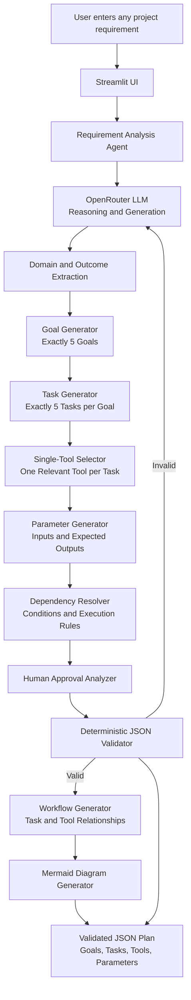

# Universal Agentic AI Workflow Generator — Planning Document

## 1. Objective

Build a universal, domain-neutral Agentic AI Workflow Generator that accepts any project requirement written in natural language and produces a structured, executable planning workflow.

The generated workflow must contain:

- Exactly 5 goals.
- Exactly 5 tasks under every goal.
- Exactly 25 tasks in total.
- One relevant tool for every task.
- Task-specific input parameters with realistic sample values.
- Task-specific expected output parameters with realistic sample values.
- Logical task dependencies.
- Goal-specific success criteria.
- Conditional execution rules.
- Human approval requirements where appropriate.
- An agent execution flow.
- A valid Mermaid workflow diagram.
- A validated JSON plan.

The system must analyze the user's requirement first and derive the domain, goals, tasks, tools, parameters, outputs, dependencies, and approval requirements from that requirement.

The system must not assume that every requirement belongs to banking or any other single domain.

---

## 2. Supported Domains

The generator should support any domain, including but not limited to:

- Banking
- Healthcare
- Education
- Manufacturing
- Retail
- E-commerce
- Logistics
- Finance
- Human resources
- Software
- Marketing
- Customer service
- Research
- Operations
- Unfamiliar or newly introduced domains

The domain must be inferred only from the user-provided requirement.

The generator must not attach banking tools to healthcare requirements or healthcare tools to e-commerce requirements unless the requirement explicitly requires them.

---

## 3. Scope

### In scope

- Natural-language requirement intake.
- Project title, summary, and domain derivation.
- Exactly five outcome-oriented goals.
- Exactly five relevant tasks per goal.
- One task-specific tool per task.
- Reusable tool-library definitions.
- Task-specific input and expected-output parameters.
- Realistic parameter sample values.
- Task dependencies and dependency conditions.
- Goal success criteria.
- Conditional task execution.
- Agent responsibilities and execution flow.
- Human approval identification.
- Structured JSON generation.
- JSON schema and consistency validation.
- Mermaid workflow generation.
- Local deterministic fallback when the LLM is unavailable.
- Testing across unrelated domains.

### Out of scope

- Automatic execution of generated tools.
- Automatic execution of external business actions.
- Autonomous financial, medical, legal, hiring, safety, or other consequential decisions.
- Sending emails or messages automatically.
- Changing records, making purchases, deploying systems, approving loans, or modifying credit limits.
- Inventing missing domain facts, regulations, stakeholders, tools, data, or thresholds.
- Building a full production workflow-execution platform.

The generator creates a plan. It does not execute the generated plan.

---

## 4. Core Agentic Design

The system must represent a real agentic workflow rather than a static checklist.

```text
USER REQUIREMENT
      ↓
REQUIREMENT ANALYSIS AGENT
      ↓
DOMAIN AND OUTCOME UNDERSTANDING
      ↓
GOAL GENERATION
      ↓
TASK GENERATION
      ↓
ONE TOOL ASSIGNED TO EACH TASK
      ↓
TASK INPUT PARAMETERS
      ↓
EXPECTED TASK OUTPUT PARAMETERS
      ↓
DEPENDENCY RESOLUTION
      ↓
CONDITIONAL EXECUTION RULES
      ↓
HUMAN APPROVAL CHECK
      ↓
JSON VALIDATION
      ↓
WORKFLOW AND MERMAID GENERATION
      ↓
FINAL STRUCTURED PLAN
```

The agent must:

1. Read the complete requirement.
2. Normalize the requirement without changing its meaning.
3. Infer the project domain from the requirement.
4. Identify the important outcomes, users, activities, data, decisions, outputs, risks, validations, and approvals.
5. Create exactly five meaningful goals.
6. Create exactly five tasks under every goal.
7. Assign exactly one relevant tool to every task.
8. Generate task-specific parameters and sample values.
9. Create only logically required dependencies.
10. Define success criteria for each goal.
11. Mark tasks that can be conditionally skipped.
12. Identify human approval for consequential or external actions.
13. Validate the complete result before returning it.
14. Preserve the original requirement for traceability.
15. Never automatically execute a generated tool.

---

## 5. Goal Requirements

Generate exactly five goals and exactly 25 tasks.

Goals must be:

- Specific.
- Relevant to the requirement.
- Action-oriented.
- Outcome-focused.
- Non-duplicative.
- Understandable to a normal user.

Do not blindly create generic goals such as:

- Understand the requirement.
- Identify stakeholders.
- Build the solution.
- Validate the project.

These may be used only when they are genuinely relevant to the requirement.

For the commercial-banking example, the five business areas should cover:

1. Assess customer financial and relationship health.
2. Detect early warning signals and customer risk.
3. Identify cross-sell, retention, and growth opportunities.
4. Prepare Relationship Manager intelligence and next-best-action.
5. Generate compliant customer communication and human approval.

For every other domain, derive five appropriate goals from the user's requirement instead of forcing these banking goals.

---

## 6. Goal Success Criteria

Every goal must contain between 3 and 6 success criteria.

Success criteria must be measurable or verifiable.

Examples:

- Required information is identified and traceable to the requirement.
- Relevant risks are detected using defined rules.
- Each recommendation is supported by task outputs.
- The generated workflow contains exactly 25 tasks.
- Every task has exactly one relevant tool.
- Human approval is required before an external action.
- The final JSON passes all structural and safety validation.

Avoid vague criteria such as:

```text
System works properly.
```

---

## 7. Task Requirements

Every goal must contain exactly five tasks.

Every task must:

- Contribute directly to its parent goal.
- Be specific and actionable.
- Be relevant to the requirement.
- Be different from other tasks.
- Follow a logical sequence.
- Have exactly one tool.
- Have meaningful input parameters.
- Have meaningful expected output parameters.
- Include realistic sample values.
- Include dependencies where needed.
- Include an execution condition.
- Include `human_approval_required` as a Boolean.

Do not repeat the same generic tasks under every goal.

Do not use generic placeholder outputs such as `completed_task_result` or `completion_status` unless the task genuinely produces those results.

Expected outputs must represent the actual result of the task, for example:

- `financial_health_score`
- `balance_change_percent`
- `payment_risk_level`
- `opportunity_score`
- `recommended_action`
- `meeting_summary`
- `email_subject`
- `compliance_status`
- `approval_status`

---

## 8. Tool Design

Each task must call exactly one tool.

A task must not contain multiple tools.

A task must not exist without a tool.

Do not create one giant tool that performs the entire workflow.

Tools must be reusable, action-oriented, and selected based on the specific task.

Every tool definition must contain:

- `name`
- `description`
- `purpose`

The tool library may contain tools such as:

- `requirement_parser`
- `stakeholder_mapper`
- `assumption_register`
- `criteria_builder`
- `requirement_classifier`
- `risk_register`
- `dependency_mapper`
- `solution_designer`
- `workflow_sequencer`
- `condition_designer`
- `task_decomposer`
- `tool_selector`
- `parameter_designer`
- `acceptance_builder`
- `schema_validator`
- `count_consistency_checker`
- `workflow_integrity_checker`
- `safety_policy_checker`
- `workflow_publisher`

These are examples only. The final tools must be selected according to the user's requirement.

A banking requirement may use tools such as `get_financial_data`, `analyze_covenants`, or `calculate_risk_score`.

A healthcare requirement may use tools such as `get_appointment_history`, `analyze_no_show_patterns`, or `validate_patient_data`.

An e-commerce requirement may use tools such as `get_browsing_history`, `analyze_purchase_patterns`, or `rank_recommendations`.

Do not assign tools that the requirement does not support.

---

## 9. Input Parameters

Every task must have meaningful input parameters specific to that task.

Each input parameter must contain:

- `name`
- `description`
- `type`
- `required`
- `sample_value`

Parameter names must describe the actual value.

Prefer specific names such as:

- `customer_id`
- `financial_data`
- `current_balance`
- `historical_balances`
- `payment_history`
- `covenant_thresholds`
- `product_gaps`
- `risk_summary`
- `crm_context`
- `communication_objective`
- `requirement_text`
- `prioritized_requirements`
- `workflow_design`

Avoid generic names such as:

- `input_data`
- `data`
- `information`
- `value`
- `requirement_context`
- `task_dependencies`

unless the task genuinely requires an unrestricted object or context.

Sample values must be realistic and compatible with the declared type.

A task must not reference an input that is unavailable from the original requirement, an explicitly declared source, or a prior task output.

---

## 10. Expected Output Parameters

Every task must have meaningful expected output parameters specific to the task.

Each output parameter must contain:

- `name`
- `description`
- `type`
- `sample_value`

Examples:

```json
{
  "name": "balance_change_percent",
  "description": "Percentage change in the account balance.",
  "type": "number",
  "sample_value": -22.7
}
```

Expected outputs must describe what the tool produces, not merely state that a task is complete.

Examples include:

- `primary_outcome`
- `functional_requirements`
- `financial_findings`
- `covenant_status`
- `risk_level`
- `risk_drivers`
- `product_gaps`
- `opportunity_score`
- `recommended_action`
- `meeting_summary`
- `email_body`
- `compliance_flags`
- `approval_status`
- `published_workflow`

---

## 11. Dependencies

Represent dependencies using task IDs.

Rules:

- A task may depend on zero or more prior tasks.
- A dependency must reference an existing task.
- A task must not depend on itself.
- Dependency cycles are invalid.
- Prerequisite tasks must occur before dependent tasks.
- Missing dependencies must be marked unresolved instead of fabricated.
- Conditional dependencies must include a condition.

Example:

```json
{
  "task_id": "G003-T002",
  "depends_on": ["G003-T001"],
  "dependency_condition": "Run after the solution approach is defined."
}
```

The workflow must pass dependency validation before publication.

---

## 12. Conditional Execution

The generated agent must be able to skip irrelevant tasks during execution while retaining all 25 tasks in the project definition.

Supported execution behaviors:

- `continue`: execute the next task when the condition passes.
- `branch`: select one of multiple next tasks.
- `pause`: request clarification or human review.
- `retry`: repeat a task within a defined retry limit.
- `reject`: terminate publication when validation or safety checks fail.
- `skip`: omit a task when its input is not relevant or available.

Examples:

- If required information is missing, pause and request clarification.
- If a dependency is unresolved, skip or pause the dependent task.
- If a loan is not part of the requirement, skip loan-specific analysis.
- If no external communication is requested, skip communication drafting.
- If no evidence is found, do not produce a confident recommendation.
- If validation fails, return errors instead of publishing.
- If a task creates an external commitment, require human approval.

Do not invent conditional rules that are not relevant to the requirement.

---

## 13. Human Approval

Set `human_approval_required` to `true` when a task:

- Changes project scope or priorities.
- Publishes or activates a workflow.
- Produces a consequential recommendation.
- Handles sensitive or regulated information.
- Triggers an external communication.
- Performs an irreversible action.
- Resolves a material ambiguity.
- Overrides a validation or safety warning.

Set it to `false` for internal analysis tasks that do not create consequential actions.

Required approval flow for external communication:

```text
Draft Communication
      ↓
Compliance Check
      ↓
Human Approval
      ↓
Approved?
   ↙       ↘
Yes         No
 ↓           ↓
Proceed     Stop or Revise
```

Never automatically send external communication.

A workflow must not be marked `published` when a required approval is `PENDING` or `REJECTED`.

---

## 14. Deterministic and LLM Responsibilities

Use deterministic tools for:

- Counts.
- Ratios.
- Percentages.
- Threshold comparisons.
- Trend calculations.
- Validation.
- Dependency checks.
- Schema checks.
- Risk scoring.
- Opportunity scoring.
- Safety and approval checks.

Use the LLM for:

- Summarization.
- Explanation.
- Reasoning.
- Prioritization.
- Meeting brief generation.
- Communication drafting.
- Interpreting unstructured text.
- Document question answering.

Do not use the LLM for simple arithmetic, objective threshold comparisons, or structural validation.

The LLM must not override deterministic safety or approval controls.

---

## 15. Agent Definition

Generate an agent definition containing:

- `name`
- `description`
- `responsibilities`
- `execution_flow`
- `conditional_execution_rules`
- `human_approval_rules`

The agent name must be derived from the requirement, for example:

```text
Commercial Banking Relationship Manager Copilot Agent
```

For another domain, generate an appropriate domain-specific agent name.

The agent must pass task outputs into dependent tasks and must be able to skip irrelevant tasks.

---

## 16. JSON Output Contract

Return exactly one valid JSON object and no surrounding Markdown or commentary.

The JSON must use this structure:

```json
{
  "project": {
    "name": "",
    "domain": "",
    "objective": "",
    "source_requirement": ""
  },
  "tool_library": [
    {
      "name": "",
      "description": "",
      "purpose": ""
    }
  ],
  "goals": [
    {
      "goal_id": "G001",
      "goal_name": "",
      "goal_description": "",
      "success_criteria": [""],
      "tasks": [
        {
          "task_id": "G001-T001",
          "task_name": "",
          "task_description": "",
          "tool": {
            "name": "",
            "description": "",
            "purpose": ""
          },
          "input_parameters": [
            {
              "name": "",
              "description": "",
              "type": "",
              "required": true,
              "sample_value": ""
            }
          ],
          "expected_output_parameters": [
            {
              "name": "",
              "description": "",
              "type": "",
              "sample_value": ""
            }
          ],
          "depends_on": [],
          "dependency_condition": "",
          "human_approval_required": false,
          "execution_condition": ""
        }
      ]
    }
  ],
  "agent": {
    "name": "",
    "description": "",
    "responsibilities": [],
    "execution_flow": [],
    "conditional_execution_rules": [],
    "human_approval_rules": []
  },
  "workflow": {
    "steps": [
      {
        "from": "",
        "to": "",
        "relationship": ""
      }
    ],
    "mermaid": ""
  },
  "validation": {
    "goal_count": 5,
    "tasks_per_goal": 5,
    "total_task_count": 25,
    "all_tasks_have_one_tool": true,
    "valid_dependencies": true,
    "approval_requirements_checked": true,
    "status": "valid"
  },
  "publication_status": "pending_approval"
}
```

---

## 17. Mermaid Implementation Architecture

Include an implementation architecture diagram in the planning document.



The architecture must keep deterministic validation, count checks, dependency checks, and approval checks outside the LLM.

---

## 18. Workflow Requirements

The workflow must show relationships between:

- The original requirement.
- Goals.
- Tasks.
- One tool per task.
- Task outputs.
- Dependent tasks.
- Human approval points.
- Final results.

Every workflow step must contain:

- `from`
- `to`
- `relationship`

The Mermaid diagram should use `graph TD` or valid `flowchart TD` syntax and show task IDs and tool names where practical.

---

## 19. Validation Requirements

Validation must occur after generation and before publication.

### Structural validation

Verify:

- Result is a JSON object.
- Required top-level fields exist.
- Exactly five goals exist.
- Exactly five tasks exist under each goal.
- Exactly 25 tasks exist in total.
- Goal IDs are unique and follow `G###` format.
- Task IDs are unique and follow `G###-T###` format.
- Every task has exactly one tool object.
- Every task has at least one input parameter.
- Every task has at least one expected output parameter.
- Every parameter has a name, description, type, and sample value.
- Every input parameter has a Boolean `required` field.
- Every task has a Boolean `human_approval_required` field.

### Relevance validation

Check that:

- Goals relate to the requirement.
- Tasks relate to their parent goals.
- Tools relate to their assigned tasks.
- Input parameters are needed by their tasks.
- Outputs describe actual task results.
- Tools are not blindly repeated without justification.
- Generic placeholders are not used unnecessarily.

### Dependency validation

Verify:

- Dependencies reference existing task IDs.
- No task depends on itself.
- No circular dependencies exist.
- Dependency conditions are present when needed.
- Prerequisite tasks occur before dependent tasks.

### Safety validation

Verify:

- External actions have human approval requirements.
- Consequential actions cannot proceed without approval.
- No automatic external sending is defined.
- Missing information leads to clarification or an unresolved state.
- The LLM cannot override safety controls.

If validation fails, return structured validation errors and do not publish the workflow.

---

## 20. Testing Strategy

Test the generator with unrelated requirements, including:

### Commercial banking

Generate customer-health, risk, opportunity, recommendation, communication, and approval planning tasks only when supported by the requirement.

### Healthcare

Generate healthcare-relevant goals and tasks, such as appointment analysis or no-show prediction, without banking tools.

### E-commerce

Generate product, browsing, purchase, recommendation, and evaluation tasks without healthcare or banking tools.

### Education

Generate learner, curriculum, assessment, and engagement tasks when supported by the requirement.

### Software

Generate product, architecture, implementation, testing, deployment, and maintenance tasks when supported by the requirement.

For every test requirement, verify:

- Exactly five goals.
- Exactly five tasks per goal.
- Exactly one tool per task.
- Tools are relevant to each task.
- Parameters are task-specific.
- Sample values match their declared types.
- Outputs are task-specific.
- Dependencies are valid and acyclic.
- Success criteria are measurable.
- Human approval is identified where appropriate.
- Workflow relationships are present.
- Mermaid syntax is valid.
- The final result is valid JSON.

---

## 21. Development Phases

### Phase 1 — Foundation

Create the project structure, configuration, environment handling, and JSON data models.

### Phase 2 — Requirement Analysis

Implement requirement intake, normalization, domain extraction, and project-summary generation.

### Phase 3 — Goal and Task Generation

Generate exactly five goals and exactly five tasks under each goal. Reject duplicate or generic task sets.

### Phase 4 — Tool and Parameter Generation

Assign exactly one relevant tool to every task and generate task-specific inputs and expected outputs with sample values.

### Phase 5 — Dependencies and Conditional Execution

Resolve task dependencies, execution conditions, skip rules, branch rules, retry rules, pause rules, and rejection rules.

### Phase 6 — Agent and Workflow Generation

Generate the agent definition, execution flow, workflow relationships, and Mermaid diagram.

### Phase 7 — Validation and Safety

Apply structural, relevance, dependency, count, schema, and human-approval validation before publication.

### Phase 8 — User Interface

Build a simple interface for requirement input, goal/task count configuration if supported, generated JSON display, Mermaid workflow display, and validation errors.

### Phase 9 — Testing and Demonstration

Test banking, healthcare, e-commerce, education, software, and unfamiliar-domain requirements. Demonstrate conditional task selection and human approval handling.

---

## 22. Final Scope

The final system is:

> A universal Agentic AI Workflow Generator that analyzes any natural-language project requirement and generates five meaningful goals, five relevant tasks per goal, one specific tool per task, task-specific parameters and outputs, dependencies, success criteria, conditional execution rules, human approval requirements, a Mermaid workflow, and validated JSON.

The system is a planning assistant only. It must not automatically execute generated tools or external actions.
