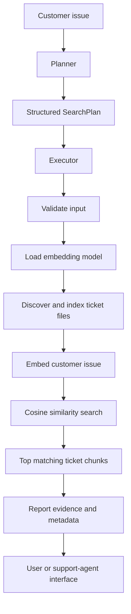

# Problem 16.1 — Planner and Executor Plan

## Objective

Extend the Problem 16 semantic ticket search system with a planner-executor workflow. The planner should turn a customer issue into an explicit sequence of actions. The executor should run those actions using the semantic search implementation and return inspectable results.

The workflow must remain grounded in the ticket files and must not invent ticket information.

## Existing System

The Problem 16 system already provides:

- Dynamic discovery of `.txt` files in `tickets/`
- Ticket text loading
- Ticket chunking
- Sentence Transformer embeddings
- Persistent local vector data
- Cosine-similarity search
- Ticket metadata and similarity scores
- Interactive query input

The Problem 17 implementation should reuse these functions instead of duplicating search logic.

## Planner Responsibilities

The planner accepts a customer issue and creates a structured `SearchPlan`.

### Planner input

```text
Customer issue: The application keeps logging me out
```

### Planner output

The plan should contain:

1. `validate` — Confirm that the issue is not empty.
2. `load_model` — Load the configured embedding model.
3. `index` — Discover ticket files, chunk them, create embeddings, and update the local index.
4. `search` — Search for the top semantic matches.
5. `report` — Return ticket IDs, source files, scores, resolution status, and matching text.

The plan should be deterministic and easy to print or inspect before execution.

## Executor Responsibilities

The executor receives a valid `SearchPlan` and runs its actions in order.

### Executor behavior

1. Validate the plan query.
2. Load the embedding model.
3. Index the available support-ticket files.
4. Generate an embedding for the customer issue.
5. Calculate semantic similarity against indexed ticket vectors.
6. Select the top three or four results.
7. Return a structured result.

### Executor result

```python
{
    "query": "The application keeps logging me out",
    "ticket_count": 10,
    "chunk_count": 10,
    "results": [
        {
            "ticket_id": "ticket_001",
            "source": "ticket_001.txt",
            "chunk_id": "ticket_001_chunk_0",
            "resolution_status": "resolved",
            "similarity": 0.87,
            "text": "..."
        }
    ],
    "found": True
}
```

## Workflow



## Implementation Structure

### `planner_executor.py`

Create the following components:

- `PlanStep` dataclass
- `SearchPlan` dataclass
- `create_plan(query, n_results=4)`
- `execute_plan(plan, model_loader=load_embedding_model)`
- `print_plan(plan)`
- `run_planner_executor()` interactive entry point

Import these existing Problem 16 functions:

- `load_embedding_model`
- `index_tickets`
- `search_tickets`
- `display_results`

Use an explicit import path or package structure so the Problem 17 script can reliably reuse Problem 16.

## Error Handling

The executor should handle these cases without a traceback for normal users:

- Empty customer issue
- Missing `tickets/` folder
- Empty `tickets/` folder
- Invalid or unreadable ticket files
- Embedding-model loading failure
- Indexing failure
- Search failure
- No search results

Expected messages should be concise, for example:

```text
Please enter a customer issue.
Execution failed safely: No support ticket files were found.
```

## Interactive Workflow

The command-line workflow should be:

```text
============================================================
PLANNER-EXECUTOR SUPPORT TICKET SEARCH
============================================================

Customer issue (type 'exit' to quit): The app keeps logging me out

PLAN
1. validate: Validate the customer issue.
2. load_model: Load the local embedding model.
3. index: Read ticket files and update the persistent local index.
4. search: Retrieve the top 4 semantic matches.
5. report: Return ticket IDs, scores, status, and matching text.

Executing plan...

SEARCH RESULTS
...
```

The loop should continue accepting issues until the user enters `exit`.

## Verification Plan

### Unit tests

1. `create_plan()` rejects empty input.
2. `create_plan()` creates all expected steps.
3. The plan stores the cleaned query.
4. `execute_plan()` works with a fake embedding model.
5. Empty or missing ticket data produces a safe failure.
6. The executor returns `found=True` when matches exist.

### Integration tests

1. Load the ticket files from Problem 16.
2. Create a plan for `The application keeps logging me out`.
3. Execute the plan.
4. Confirm ticket counts and result metadata.
5. Confirm the matching text is displayed.
6. Confirm a second query can be processed without restarting the program.

### Acceptance test

Use a paraphrase with different wording:

```text
Historical issue: Session expires randomly every few minutes.
Customer issue: App keeps logging me out.
```

Confirm that the historical ticket appears in the top three results when it is present in the ticket dataset.

## Performance Considerations

- Load the embedding model once per process.
- Reuse the model for planning and execution.
- Use deterministic ticket and chunk IDs.
- Avoid rebuilding vectors unnecessarily when the local index is current.
- Keep `n_results` configurable and default it to four.
- Print progress before slow model-loading and indexing steps.

## Safety and Explainability

The planner may choose actions, but it must not fabricate ticket content. The executor must return the actual matching text and metadata from the indexed files. Every result should include:

- Ticket ID
- Source filename
- Chunk ID
- Resolution status
- Similarity score
- Matching text

The planner-executor layer should only organize and run search operations. It should not make unsupported customer-service decisions.

## Run Command

From the Problem 17 folder:

```powershell
Set-Location "c:\Users\user\Documents\AgenticAITraining\Vineetha_Varanasi_EY\problem_17_planner_executor"

c:\Users\user\Documents\AgenticAITraining\Vineetha_Varanasi_EY\.venv\Scripts\python.exe planner_executor.py
```

## Completion Criteria

The implementation is complete when:

- A customer issue produces a visible structured plan.
- The executor runs the plan successfully.
- Semantic search returns the top matching historical tickets.
- Results include scores and evidence metadata.
- Empty and invalid inputs fail safely.
- Unit and integration tests pass.
- The workflow can process multiple queries in one session.
